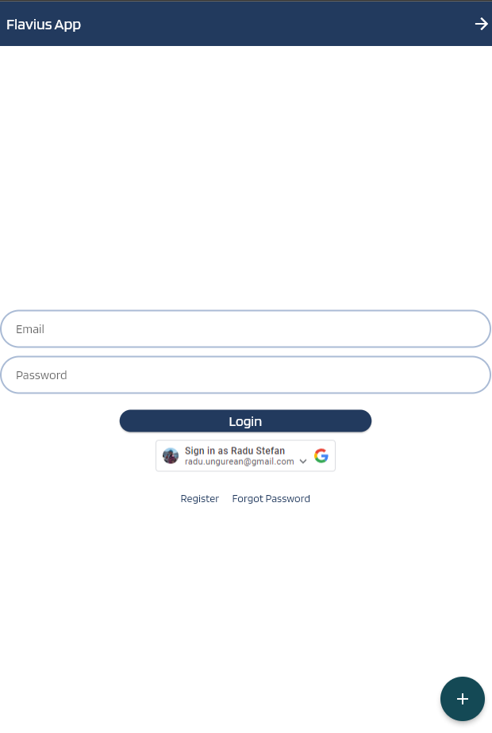
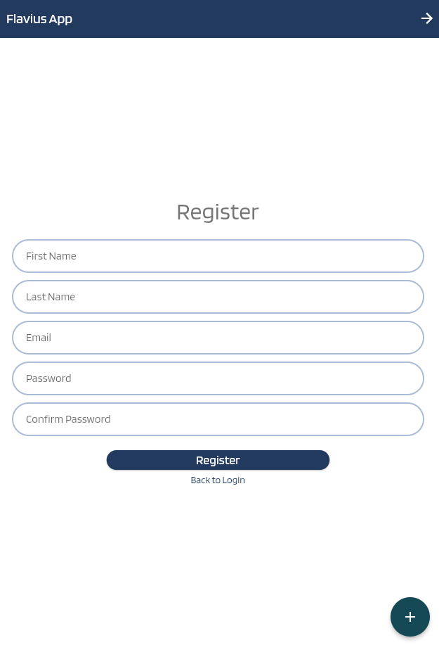
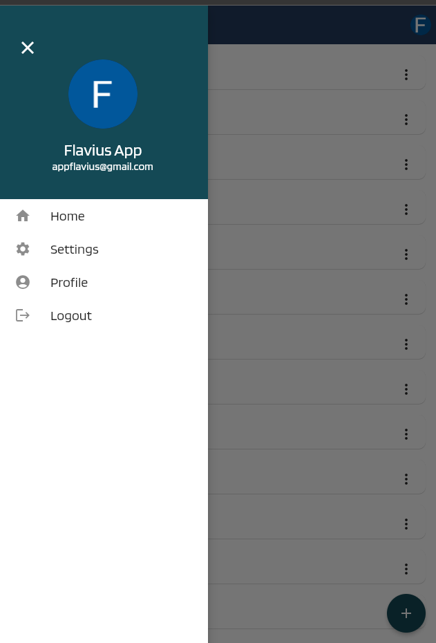
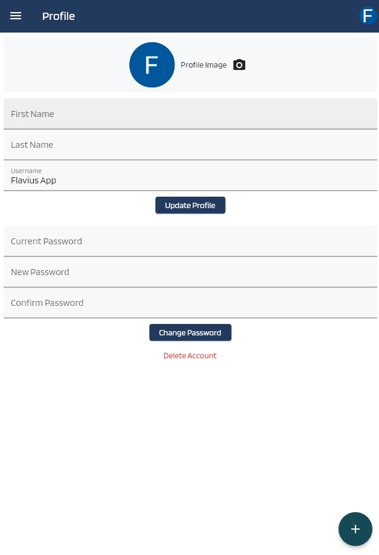
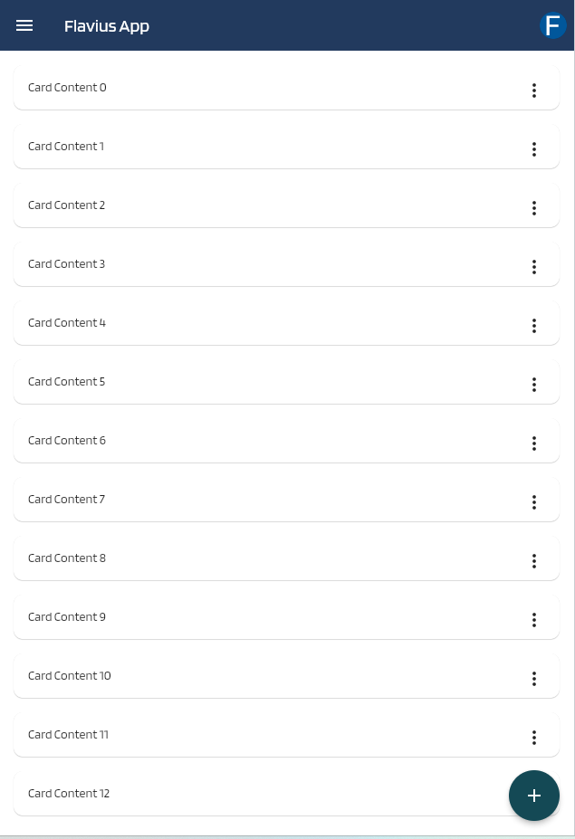

# Flutter Firebase Riverpod Authentication App

This app leverages Firebase authentication in Flutter, integrated with Riverpod for state management. It uses Firebase's email authentication and Google provider for a seamless user experience.

## Features

- **Login Screen**: Authenticate using either email or Google account.
- **Register Screen**: Sign up for a new user account.
- **Forgot Password Screen**: Reset password via email.

## Getting Started

### Prerequisites

- Flutter SDK
- Firebase account

### Important: Firebase Rules

Before deploying your app or moving to production, ensure you've set up the necessary security rules for both the users collection and the files bucket in Firebase. Inappropriate or lax rules can expose sensitive data, so always double-check to ensure data security.

### Firebase CLI & FlutterFire CLI Setup

1. **Install the Firebase CLI**:
   If you haven't already installed the Firebase CLI, you can do so by following the Firebase documentation.

2. **Login to Firebase**:
   Log into Firebase using your Google account by executing:

3. **Install the FlutterFire CLI**:
   To setup Firebase with Flutter, we'll use the FlutterFire CLI. Install it using:

4. **Configure FlutterFire**:
   Use the `flutterfire configure` command to connect your Flutter apps to Firebase. Remember, you'll need to re-run this command if you:
- Start supporting a new platform in your Flutter app.
- Incorporate a new Firebase service or product in your app.
### CORS Configuration for Firebase Storage

To ensure that Firebase Storage operates correctly with web applications, you need to set up Cross-Origin Resource Sharing (CORS). The project already contains a predefined `cors.json` file at the root.

**Setting CORS**:
   Navigate to the project root and run the following command:
``gsutil cors set cors.json [firebase_storage_bucket_name]``

Replace `[firebase_storage_bucket_name]` with your Firebase Storage bucket's name when executing the command.

**Screenshots**:

